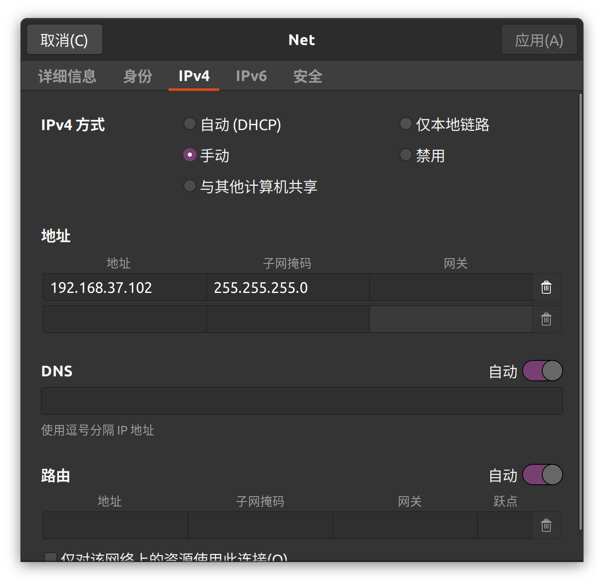
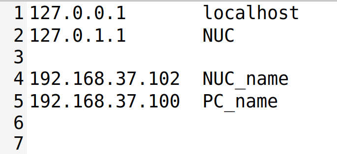
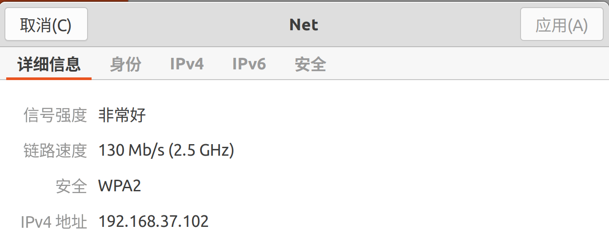
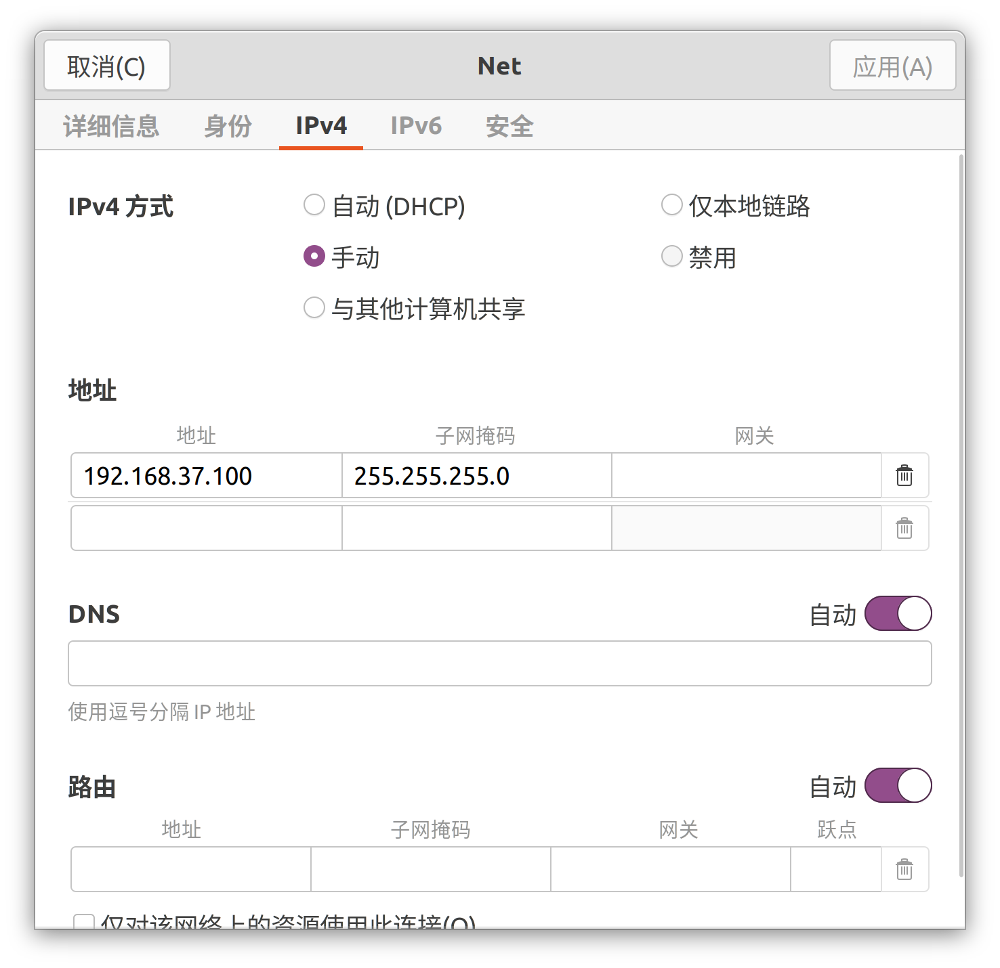
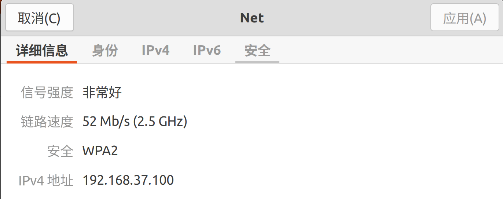

# ROS多机通信

设NUC为主机，PC为从机，

NUC_IP，PC_IP为自己喜欢的主机IP，从机IP

PC_name，NUC_name为自己喜欢的主机名，从机名，与系统的主机名，用户名无关

本文中：

NUC_IP = 192.168.37.102		PC_IP = 192.168.37.100

NUC_name = NUC_name		PC_name = PC_name			


## 主机端

### 1. 设置IP并固定IP

连接wifi/热点后，进入wifi设置->IPv4

将IP设为手动，并填入NUC_IP，子网掩码



### 2. 设置主机名解析

```bash
sudo gedit /etc/hosts
```

填入主机，从机的主机名和对应的IP

NUC_IP	NUC_name

PC_IP	   PC_name



### 3. 设置环境变量

打开.bashrc

```bash
sudo gedit ~/.bashrc
```

添加以下内容

```bash
export ROS_HOSTNAME=NUC_name
export ROS_MASTER_URI=http://NUC_name:11311
```

更新环境变量

```bash
source ~/.bashrc
```

### 4. 重连wifi/热点

重启wifi，并连接到wifi/热点，检查 wifi设置->详细信息 中，IP是否与之前设置的手动IP一致



## 从机端

### 1. 设置IP并固定IP

连接wifi/热点后，进入wifi设置

将IP设为手动，并填入PC_IP，子网掩码



### 2. 设置主机名解析

```bash
sudo gedit /etc/hosts
```

填入主机，从机的主机名和对应的IP

NUC_IP	NUC_name

PC_IP	   PC_name


### 3. 设置环境变量

打开.bashrc

```bash
sudo gedit ~/.bashrc
```

添加以下内容

```bash
export ROS_HOSTNAME=PC_name
export ROS_MASTER_URI=http://NUC_name:11311
```

更新环境变量

```bash
source ~/.bashrc
```

### 4. 重连wifi/热点

重启wifi，并连接到wifi/热点，检查 wifi设置->详细信息 中，IP是否与之前设置的手动IP一致



## 测试

在主机上启动ros节点，在从机上检查是否能收到topic

```bash
rostopic list
```

